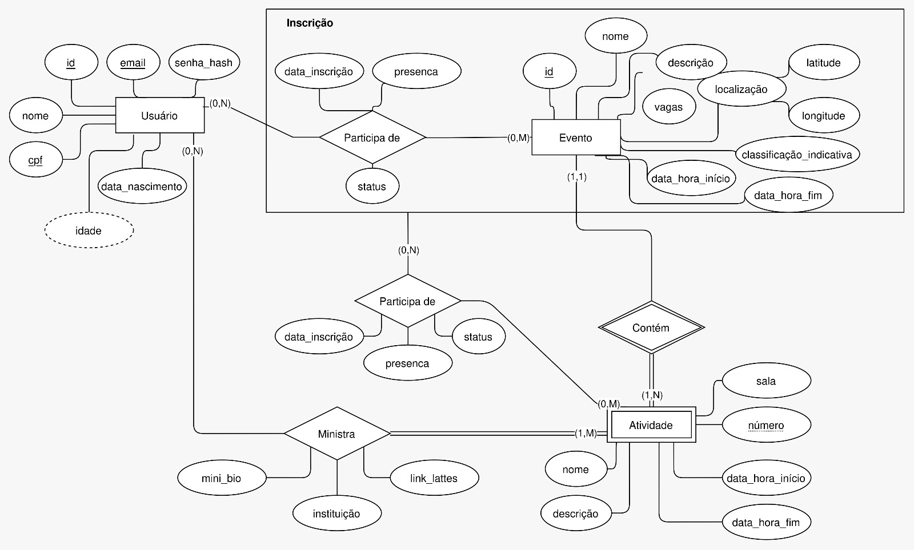
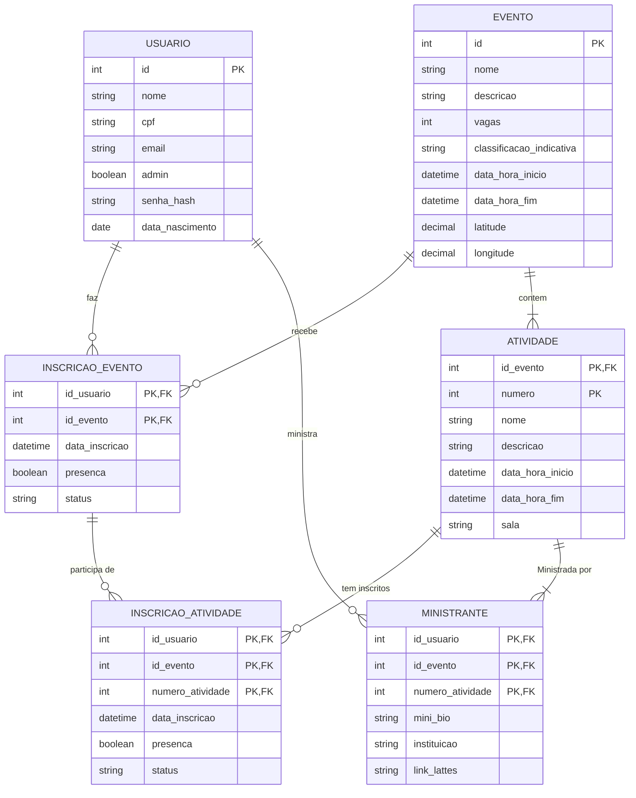

# Trabalho Prático de Fundamentos de Bancos de Dados - 2026.1

## Descrição

Esse repositório contém um sistema de gestão de eventos simples para exemplificar o
trabalho da disciplina de Fundamentos de Bancos de Dados.

Em [./docs/regras-de-negocio.md](./docs/regras-de-negocio.md) estão definidos os requisitos 
funcionais da aplicação.

## Etapas

### Diagrama ER
 

O relacionamento entre as entidades foi modelado utilizando a notação EER de ... Pelo draw.io.

### Modelo Relacional

A partir do modelo EER, as entidades e relacionamentos foram convertidas para o modelo relacional
que representa as mesmas relações de forma tabular e com chaves primárias e estrangeiras definidas:

